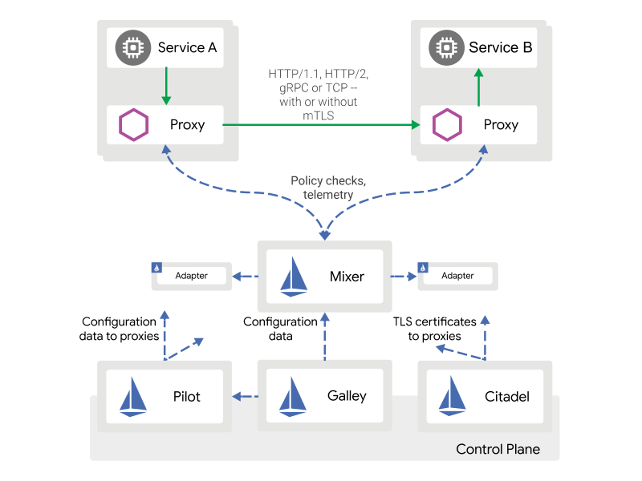

# Deploy Istio on Kubernetes
Istio is a service mesh designed to enhance and give you better insight into your cluster and microservices.



Alternatives to Istio:
* Linkerd
* Traefik
* Consul
* Kuma

## Istio Architecture
The components making Istio are:
- Envoy
- Pilot
- Citadel
- Galley

### 1. Mixer
    Mixer enforces access control and usage policies across the service mesh, and collects telemetry data from the Envoy proxy and other services.

### 2. Pilot
    Pilot provides service discovery for the Envoy sidecards, traffic management capabilities for intelligent routing (e.g. A/B tests, canary rollouts, etc), and resiliency (timeouts, retires, circuit breakers, etc.)

### 3. Citadel
    Citadel enables strong service-to-service and end-user authentication with built-in identity and credential management.

### 4. Galley
    Galley is Istio’s configuration validation, ingestion, processing and distribution component. It is responsible for insulating the rest of the Istio components from the details of obtaining user configuration from the underlying platform (e.g. Kubernetes).


## Istio Installation

1. Download Istio & configure istioctl

```bash
$ curl -L https://istio.io/downloadIstio | sh -
$ cd istio-1.15.1/
$ export PATH=$PWD/bin:$PATH
$ istioctl version
```
```bash
no running Istio pods in "istio-system"
1.15.1
```

2. Pre-flight check to verify that Istio can be installed in your cluster.
```bash
$ istioctl x precheck
```
```bash
✔ No issues found when checking the cluster. Istio is safe to install or upgrade!
  To get started, check out https://istio.io/latest/docs/setup/getting-started/
```

3. Choose the configuration profile you want to use. The default profile is recommended for most use cases.

[Check out the profiles](https://istio.io/latest/docs/setup/additional-setup/config-profiles/)

***Note***: Installing profiles that include the Ingress or Egress Gateway will automatically spin up an external load balancer.

4. Install default profile
```bash
$ istioctl install --set profile=default -y
```